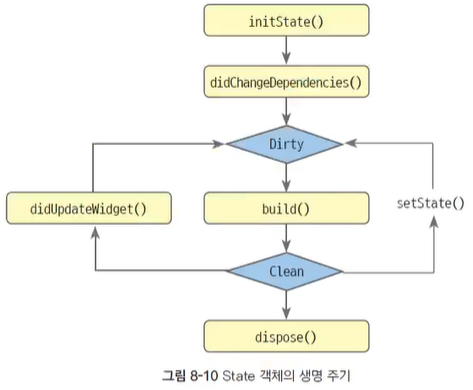

# 3. User Interface

## 08-1, 2 위젯, 위젯 트리

플러터의 위젯은 화면과 관련된 모든 것을 말하며 위젯은 불변이다.

- 선언형 UI 프로그래밍

객체 선언에 정보만 전달해준다.

플러터에서는 위젯 트리를 갖는다. 계층 구조로 layout이 짜인다고 볼 수 있다. 그리고 내부적으로는 3개의 트리를 갖는다.

위젯 트리 -> 엘리먼트 트리 -> 렌더 트리

위젯 트리 : 개발자가 선언한 것

엘리먼트 트리 : 화면을 보이기 위한 객체 트리

렌더 트리 : 실제 화면으로 보이게 하는 트리, 위젯 개수와 다를 수 있다.


## 08-3. 위젯 종류

Widget
- StatelessWidget
- StatefulWidget
- 상속 위젯

보통 Stateless, Stateful을 사용하는데 Stateful은 상태(data)가 변화하는 것을 re-rendering해줄 때 사용한다. 개발할 때 무조건 statefulWidget만 사용하지 않는다.

#### StatefulWidget
statefulWidget은 state 클래스를 갖는다. setState라는 함수로 re-rendering할 수 있도록 한다.

위젯은 불변하다. 그래서 다시 생성할 수 있는 구조로 관리된다. 변하는 값에 대해서는 메모리에 저장 시켜두고 변한 값만 확인해서 메모리에서 값만 변경시키기 위해 따로 클래스를 뺀 것이다. 그게 state 클래스고 거기서만 변경이 이루어지도록 한다. setState() 함수를 사용해서 re-rendering 하도록 한다.

## 08-4.정적 화면, 동적 화면 예제 점검
## 08-5. 상태의 생명 주기 (State Class)



주로 재 정의 되는 함수
- build() : 화면 rendering 때문에 필수★
- initState() : 자주 사용, 객체 생성되자 마자 가장 먼저 최초 한번 호출, 자신들의 상태값 초기화, 초기값 세팅, 이벤트(이벤트 리스너-핸들러) 등록
- setState() : State의 상태(data)를 변경할 때 호출하는 함수
- Clean : state에 의해 화면이 출력되고 있는 정상 상태
- Dirty : 화면에 반영되지 않은 상태, State 화면을 다시 빌드해야 하는 상태
- didChangeDependencies() : 상위 위젯에서 하위 위젯으로 변경된 상태를 전달할 때 호출된다.
- didUpdateWidget() : 상태가 변화될 때를 감지할 때 호출한다. 여기서 build()를 호출한다고 한다.
- dispose() : 자주 사용, 객체가 메모리에서 소멸될 때 마지막으로 실행되는 함수


## BuildContext

Widget은 BuildContext를 갖는다. BuildContext는 __위젯 객체의 정보__ 를 갖고 있으며 상위 위젯에도 접근을 할 수가 있다. 그렇지만 이것은 좋은 방법은 아님.

Widget은 Key를 가질 수 있다. stateless에는 크게 상관이 없을 수도 있다. stateful에도 서로 다른 클래스를 사용하면 상관없을수 있다. 하지만 목록형에 stateful을 쓸 때 서로 다른 객체임을 알리려면 __키(Key)__ 를 부여해야 한다.


## 09-1. asset

image, text 등의 파일 resources

pubspec.yaml 파일에 flutter.aseets 에 리소스 경로들, assets 경로들을 설정한다.

폴더 경로 지정 예시

assets 경로(Path)는 플러터 프로젝트의 루트부터 시작한다. `lib` directory와 같은 레벨에 위치한다.

```yaml
# pubspec.yaml
flutter:
    assets:
        - resources/images/
        - resources/images/icon/
        - resources/assets/text/
```

예제 소스
```dart
// test.dart
import 'package:flutter/material.dart';
import 'package:flutter/services.dart';

void main() {
  runApp(MyApp());
}
class MyApp extends StatelessWidget {
  // 미래 발생할 타입 : Futrue
  Future<String> useRootBundle() async {
    return await rootBundle.loadString('resources/assets/text/my_text.txt');
  }
  Future<String> useDefaultAssetBundle(BuildContext context) async {
    return await DefaultAssetBundle.of(context).loadString("resources/assets/text/my_text.txt");
  }
  @override
  Widget build(BuildContext context) {
    return MaterialApp(
      home: Scaffold(
        appBar: AppBar(
          title: Text("test"),
        ),
        body: Column(
          children: [
            Image.asset("resources/images/icon.jpg"),
            Image.asset("resources/images/icon/user.png"),
            FutureBuilder(
                future: useRootBundle(),
                builder: (context, snapshot ) {
                  return Text("rootBundle : ${snapshot.data}");
                }
            ),
            FutureBuilder(
                future: useDefaultAssetBundle(context),
                builder: (context, snapshot ) {
                  return Text("DefaultAssetBundle : ${snapshot.data}");
                }
            )
          ],
        ),
      ),
    );
  }
}
```